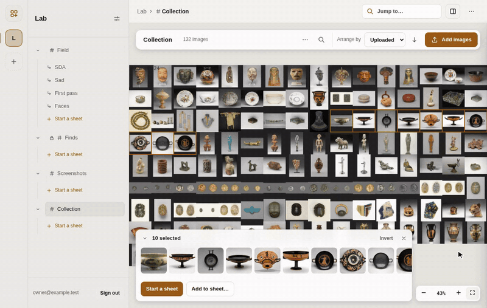
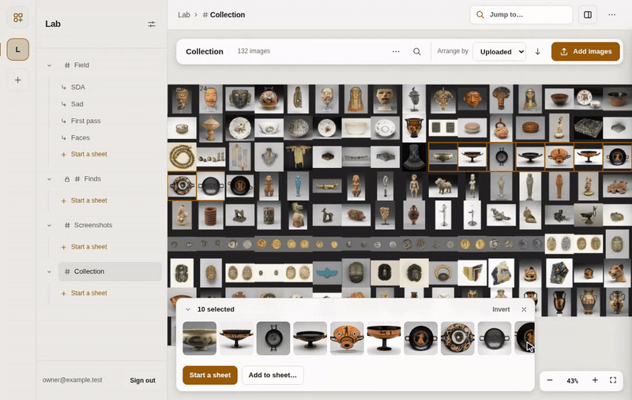
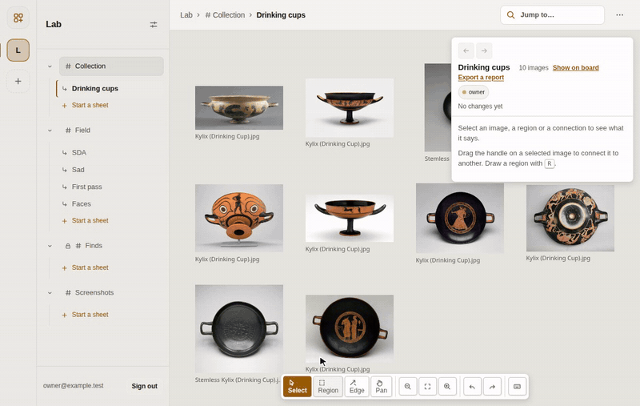
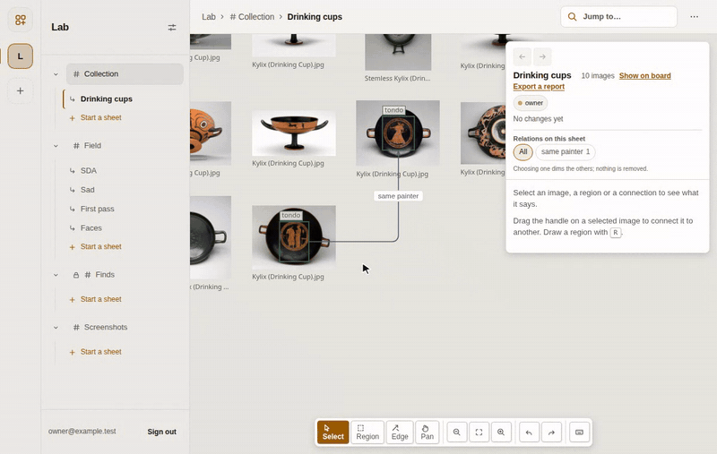
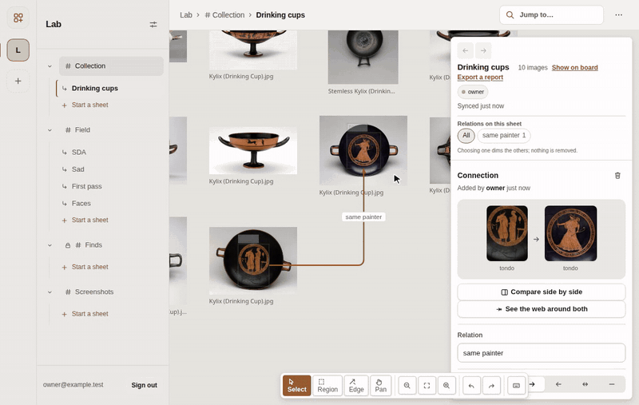

# digsite

A place where a group sorts a large pile of pictures together, and works
out how the pictures are connected.

Everything starts on a **board**: all of a group's pictures on one map,
which anyone can arrange and search. When a few pictures need a closer look,
someone starts a **sheet**. A sheet is a document where several people
arrange those pictures by hand, mark regions on them, and connect them with
named relations. The board shows what every sheet found. `CONTEXT.md` defines
these words and the others the code uses.

## What it looks like

**The board is a map.** Every picture has a place on it. Zoom in, and point
at a picture to read its properties.


**Arrange it and ask it.** Arrange by meaning puts similar pictures side by
side. Find dims everything except the answer. You can search by words, or
describe what is in the picture.



**Start a sheet from what you found.** Select the matches, name the sheet,
and it opens with those pictures on it.



**Mark and connect.** Draw a region and name it; the names the board already
uses are offered first. Drag the handle from one region to another, then
name the relation.



**Say what you know.** A picture's details hold typed properties. A
connection's details say how sure you are, why the connection holds, and
properties of its own. A "likely" connection is drawn dashed.



**Check the claim.** A connection opens its two ends side by side, swiped,
or overlaid.



## Run it on your machine

You need [Bun](https://bun.sh) and Docker.

```
cp .env.example .env
# set AUTH_SECRET in .env: openssl rand -hex 32
bun install
bun run db:up
bun run db:migrate
bun run dev
```

Then, in a second terminal, `bun run seed` fills a group called Lab with
sample boards and sheets. Open http://localhost:5180 and sign in as
`owner@example.test` with the password `password1234`.

Two features are off until you turn them on in `.env`:

- `EMBEDDINGS=on` — Arrange by meaning, Find by meaning, and "more like
  this". The first use downloads about 150 MB of model weights.
- `IMPORT_ROOTS=<folder>` — import a board from a folder on the server's
  disk. Several folders are separated by `:`.

`bun run infra:up` starts Postgres and a local minio instead of Postgres
alone; set `STORAGE=s3` in `.env` to use it.

## Check a change

| Command | What it proves |
| --- | --- |
| `bun run check` | Types in every workspace, Biome, and the seams in `.claude/rules/` (`scripts/lint-seams.ts`) |
| `bun run test` | Every workspace's unit tests, against the `db:up` Postgres |
| `bun run e2e:fresh` | The whole app, end to end, on its own database and ports |
| `bun run smoke` | Each screen's definition of done (`web/scripts/smoke*.ts`), against a stub server with no database |

`e2e:fresh` makes a throwaway database and data folder, starts its own
server and web on free ports, runs the suites in `e2e/src/`, and removes
everything. It does not touch your dev server or your database.
`.github/workflows/ci.yml` runs all four on every push and pull request.

## Deploying

You need a Linux machine with Docker and Docker Compose, and a domain with
two DNS records pointing at it: the bare domain and `api.` plus that domain.
`deploy/Caddyfile` serves the app at the first and the API at the second;
that file says why they are split.

```
git clone <this repo> && cd digsite
cp deploy/.env.production.example deploy/.env
# edit deploy/.env: DOMAIN, POSTGRES_PASSWORD, AUTH_SECRET (openssl rand -hex 32)
docker compose -f deploy/docker-compose.yml --env-file deploy/.env up -d --build
```

The default storage is a Docker volume (`STORAGE=fs`). To use the bundled
minio, add `--profile s3` to the last command and set the `S3_*` variables in
`deploy/.env`. To use a real bucket, point `S3_ENDPOINT` at it and leave the
profile off. Caddy gets TLS certificates for both names the first time it
starts, so wait a minute before the first visit.

To confirm it is up, `curl https://api.<your domain>/readyz` must answer
`{"ready":true,...}`. Then run the production smoke test from any machine
with Bun and Playwright:

```
PROD_ORIGIN=https://<your domain> bun run smoke:prod
```

## Variables that matter

| Variable | Meaning |
| --- | --- |
| `DOMAIN` | The app's domain; Caddy serves it and `api.$DOMAIN` |
| `POSTGRES_PASSWORD` | Postgres's own password; do not reuse one |
| `AUTH_SECRET` | Signs sessions; the server refuses to start without it, or at the example value |
| `STORAGE` | `fs` (a named volume) or `s3` (any S3-compatible bucket) |
| `S3_ENDPOINT`, `S3_BUCKET`, `S3_ACCESS_KEY`, `S3_SECRET_KEY` | Read only when `STORAGE=s3` |
| `EMBEDDINGS` | `on` for search and arrangement by meaning |
| `IMPORT_ROOTS` | Folders a board may be imported from; empty turns folder import off |
| `GROUP_QUOTA_GB` | Storage each group may use; `0` is no limit |

Everything else (`WORKER_CONCURRENCY`, `LADDER_BUDGET_MB`,
`MATERIALISE_BUDGET_MB`, `COARSE_BUDGET_MB`, `INVITATION_EXPIRES_IN`) tunes
performance and has a working default. `server/README.md` and
`server/src/env.ts` say what each one limits.

## Where the data lives

Postgres keeps its own volume, `digsite-postgres`. With `STORAGE=fs`, the
`digsite-data` volume holds the originals, the ladder pages and the
materialised tiles, under `boards/<id>/...` (`server/src/storage/fs.ts`).
With `STORAGE=s3`, the same layout is keys in your bucket, and
`digsite-data` holds only uploads still in progress.

## Backing up

```
PG_CONTAINER=digsite-postgres POSTGRES_DB=digsite STORAGE=fs \
  DATA_DIR=<the digsite-data volume's mountpoint> \
  ./deploy/backup.sh ./backups
```

This writes a dated folder under `./backups`.
`docker volume inspect deploy_digsite-data` prints the volume's mountpoint.
With `STORAGE=s3`, give the `S3_*` variables instead of `DATA_DIR`; the
script's header has the details. `deploy/restore.sh` reverses a backup into
a database and a `DATA_DIR` that are both empty. `e2e/src/backup-restore.ts`
tests the round trip against the dev stack (`bun run backup-restore` from
`e2e/`).

A backup is proven only when it restores. Once a month, run
`deploy/restore-drill.sh ./backups` with the same `PG_CONTAINER` and
`STORAGE`. It restores the newest backup into a scratch database, checks
that every table holds the rows the dump carried, and checks a sample of
originals and ladder pages. Then it drops the scratch copy. It exits
non-zero on a failure, so cron mails you the reason.

With `STORAGE=s3`, the drill restores into a scratch bucket beside the live
one and removes it afterwards. Set `DRILL_SERVER_CMD` to how this deploy
starts its server, and the drill also starts a server on the restored copy
and requires `/readyz` to answer.

## Upgrading

```
git pull
docker compose -f deploy/docker-compose.yml --env-file deploy/.env up -d --build
```

The server applies its migrations every time it starts
(`deploy/Dockerfile.server`; `server/src/db/migrate.ts` skips what is
already applied), so there is no separate migrate step. Back up first all
the same: a migration cannot be reversed.

## Read next

- `CONTEXT.md` — the words, and what each one means
- `docs/design.md` — the full contract
- `docs/roadmap.md` — what is built and what is next
- `server/README.md`, `web/README.md` — each side's module map

The pictures in the recordings above are from the Art Institute of Chicago,
released under CC0. `docs/readme/README.md` says how to record them again.
